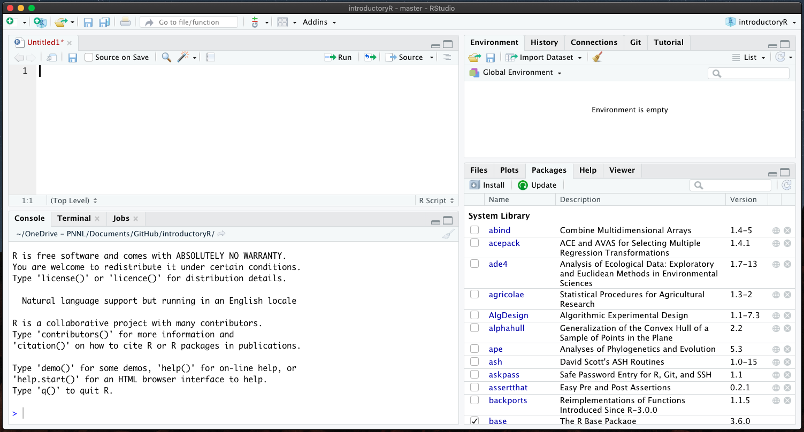
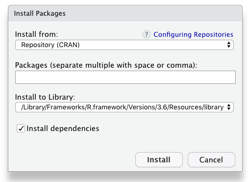

- operations, functions, and packages

## The RStudio layout


R-script files are loaded in the top left panel.  
To run a line of code, move the cursor to the line and (a) click `Run` or (b) use `cmd+return` (Mac) or `ctrl+enter` (PC).  
You can highlight multiple lines of code and run them together.  

You can track the progress of the running script in `Console`.

As you load files, they show up in the `Environment`. 

----

## Installing packages


### from CRAN  
#### OPTION 1: search the CRAN database  
In the bottom-right panel in RStudio, follow `Packages` > `Install`.  
Type the name of the package and click `Install`.

  
#### OPTION 2: using the `install.packages` command  
Use the format below.  

```
install.packages("PACKAGENAME")
```

### from GitHub
Not all packages are hosted on CRAN.  
To install GitHub-hosted packages, use this format, which uses the user and repository names:

```
install.packages("devtools") 
devtools::install_github("kaizadp/soilpalettes")
devtools::install_github("allisonhorst/palmerpenguins")

```

You need to install a package only once.  
Once installed, the required packages must be loaded each time a new session is started.  
Think of it as buying (installing) a bunch of books vs. pulling (loading) only the required books from your library.  You buy the books only once, but you pull the books each time you want to read.

Use this code to load the required packages.  
```
library(PACKAGENAME)
library(soilpalettes)
library(palmerpenguins)
``` 

*note: you need quotation marks (" ") for `install.packages()`  but not for `library()`.*

You can also use a library without loading it by specifying the package namespace for the desired function:
OPTION 1: load the package
```
library(soilpalettes)
soil_palette("bangor")
```

OPTION 2: use the namespace, defined by the double colon (::)
```
soilpalettes::soil_palette("bangor")
```

----

## Working directory
The working directory can be called up using this code:

```
getwd()
```

----

## Character and case sensitivity
The script is sensitive to letter case (uppper case vs. lower case) and characters
e.g.: the `penguins` dataset in the `palmerpenguins` package has a column named `culmen_length_mm`.  
Referring to it as `Culmen_length_mm` or `culmen length-mm` or any deviation from `culmen_length_mm` will give you an error.


