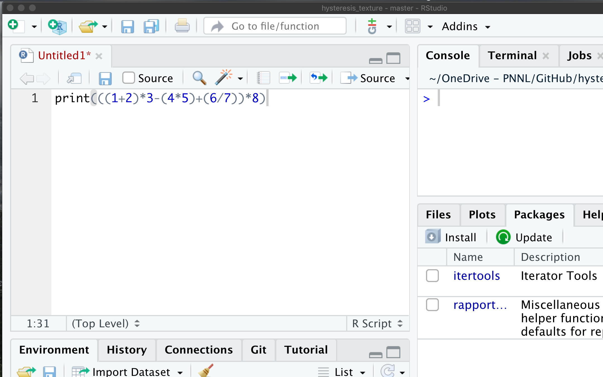
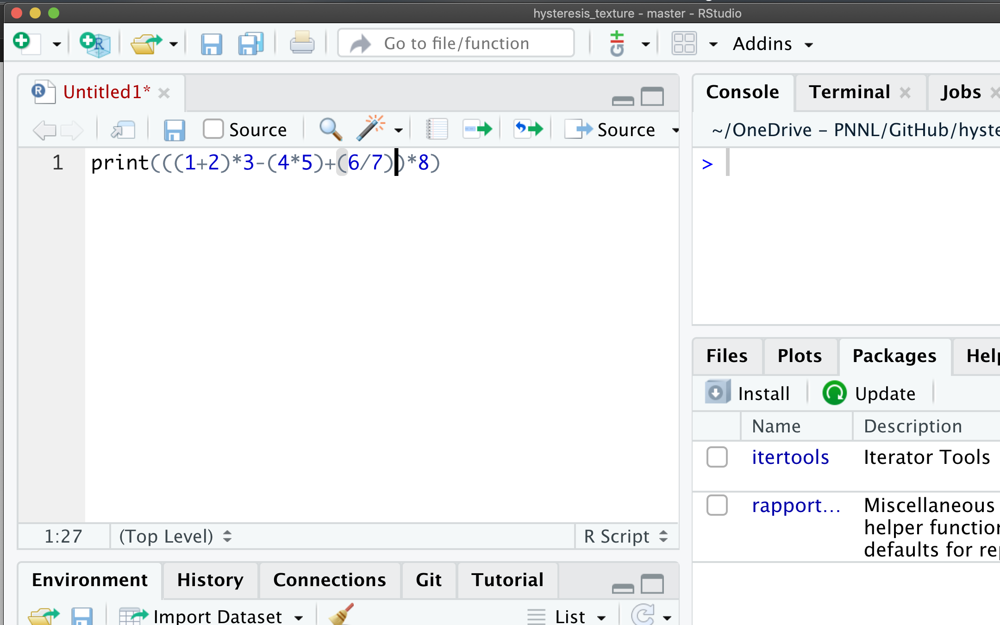

## RStudio Tips
----

### 1. Comments
A comment is a line of code that is not run.  
You add the `#` sign in front of the code you want to comment. 
You can also use this tool to add notes to your code (highly recommended), so others can follow your code.  


The `#` sign can be added at the beginning of the line, or anywhere in the line -- in all cases, code after the `#` sign will not be run.

example: 

```
print("aaa") # THIS PART WILL NOT BE RUN
```
----

### 2. Divide your script into sections
Start the line with the `#` sign and end with four or more dashes (`-`) or pounds (`#`)
Alternatively, use `Code` > `Insert Section...`.

examples:

```
# SECTION 1 ----

# SECTION 2 ####

## SECTION A -----------------

```
----

### 3. Troubleshooting your script
[This](https://twitter.com/effinbirds/status/934926651678486528) is a good resource when trying to fix errors in your code.

----

### 4. Keeping track of parentheses and other brackets
When using code with multiple, nested brackets, you can move the cursor to the close-bracket to find its match. Use this to make sure the brackets are in the right place.





