ggplot2 basics
================

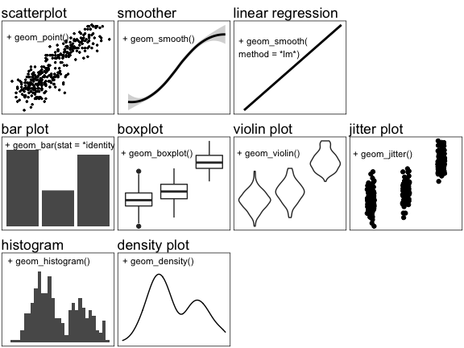<!-- -->

------------------------------------------------------------------------

This tutorial uses the `{palmerpenguins}` package, available on CRAN.

``` r
library(palmerpenguins)
library(ggplot2)
```

<details>
<summary>
click here for a quick exploration of the `penguins` dataset
</summary>

first, use the `str` function for a quick exploration of columns and
data types

``` r
str(penguins)
```

    ## tibble [344 × 8] (S3: tbl_df/tbl/data.frame)
    ##  $ species          : Factor w/ 3 levels "Adelie","Chinstrap",..: 1 1 1 1 1 1 1 1 1 1 ...
    ##  $ island           : Factor w/ 3 levels "Biscoe","Dream",..: 3 3 3 3 3 3 3 3 3 3 ...
    ##  $ bill_length_mm   : num [1:344] 39.1 39.5 40.3 NA 36.7 39.3 38.9 39.2 34.1 42 ...
    ##  $ bill_depth_mm    : num [1:344] 18.7 17.4 18 NA 19.3 20.6 17.8 19.6 18.1 20.2 ...
    ##  $ flipper_length_mm: int [1:344] 181 186 195 NA 193 190 181 195 193 190 ...
    ##  $ body_mass_g      : int [1:344] 3750 3800 3250 NA 3450 3650 3625 4675 3475 4250 ...
    ##  $ sex              : Factor w/ 2 levels "female","male": 2 1 1 NA 1 2 1 2 NA NA ...
    ##  $ year             : int [1:344] 2007 2007 2007 2007 2007 2007 2007 2007 2007 2007 ...

</details>

------------------------------------------------------------------------

------------------------------------------------------------------------

<a name = "toc"></a>

## Elements of a `ggplot` graph:

A {ggplot2} object is created in sequential layers of the foundation,
geometries, and annotations

1.  [foundation](#foundation)
2.  [geometries](#geoms)
3.  [formatting geoms](#formatting)
    -   [color and shapes](#color_shape)
    -   [colors and shapes by group](#color_shape_group)
    -   [color vs. fill](#fill)
    -   [transparency](#transparency)
4.  [color and shape scales](#color_scales)
    -   [manual color scales](#)
    -   [continuous color scales](#)
    -   [shape scales](#)
5.  [formatting axes](#axes)
    -   [axis limits](#axis_limits)
    -   [axis labels](#axis_labels)
    -   [axis scales](#axis_scales)

------------------------------------------------------------------------

------------------------------------------------------------------------

<a name = "foundation"></a>

## Step 1: set up the basic foundation plot

[*back to top*](#toc)

Specify (a) the dataset being used and (b) the mapping (x and y axes)

`aes` stands for *aesthetic*, which is used to set axes and grouping
variables (see below)

``` r
ggplot(data = penguins,
       mapping = aes(x = body_mass_g, y = flipper_length_mm))
```

It is not necessary to use `data =` and `mapping =`.

``` r
ggplot(penguins,
       aes(x = body_mass_g, y = flipper_length_mm))
```

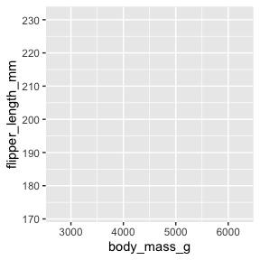<!-- -->

This creates the blank panel, on which we plot the geometries.

------------------------------------------------------------------------

------------------------------------------------------------------------

<a name = "geoms"></a>

## Step 2: add geometries

[*back to top*](#toc)

`ggplot2` uses `geom` functions to add layers with different types of
data visualization, e.g. points, lines, boxplots, violin plots, etc.
Simply add `+` at the end of the foundation line and add new layers as
needed.

**example: scatterplot**

``` r
ggplot(penguins, aes(x = body_mass_g, y = flipper_length_mm)) +
  geom_point()
```

<!-- -->

you can overlay multiple `geoms`

**example: scatterplot with linear regression line**

``` r
ggplot(penguins, aes(x = body_mass_g, y = flipper_length_mm)) +
  geom_point() +
  geom_smooth(method = "lm", se = FALSE)
```

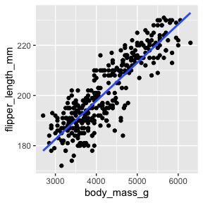<!-- -->

**example: boxplot with points**

``` r
ggplot(penguins, aes(x = island, y = flipper_length_mm)) +
  geom_boxplot()+
  geom_point()
```

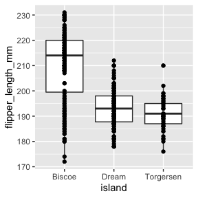<!-- -->

------------------------------------------------------------------------

------------------------------------------------------------------------

<a name = "formatting"></a>

## Step 3: format `geoms`

[*back to top*](#toc)

Modify color, shape, size by adding arguments in the `geom_*()`
parentheses.  
If you leave the parentheses blank, it will default to
`color = "black"`, `shape = 19`, `size = 1.5` for scatterplots

<a name = "color_shape"></a>

#### setting one color/shape for all points

simply type `color = ...`, etc. arguments in the `geom_*()` parentheses.

``` r
ggplot(penguins, aes(x = body_mass_g, y = flipper_length_mm)) +
  geom_point(color = "red", shape = 19, size = 2)
```

<!-- -->

`stroke = ...` will adjust the thickness of point outline

``` r
ggplot(penguins, aes(x = body_mass_g, y = flipper_length_mm)) +
  geom_point(color = "darkred", shape = 21, size = 2, stroke = 1)
```

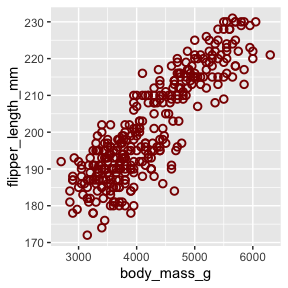<!-- -->

for `geom_smooth()` and similar line-based `geoms`, `size = ...` will
set the line thickness

``` r
ggplot(penguins, aes(x = body_mass_g, y = flipper_length_mm)) +
  geom_smooth(method = "lm", se = FALSE, color = "darkblue", size = 2)
```

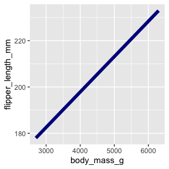<!-- -->

for `geom_smooth()` and similar line-based `geoms`, `linetype = ...`
will set the dash type. Options include `solid`, `dashed`, `longdash`,
`dotted`, `dotdash`

``` r
ggplot(penguins, aes(x = body_mass_g, y = flipper_length_mm)) +
  geom_smooth(method = "lm", se = FALSE, linetype = "longdash", size = 2)
```

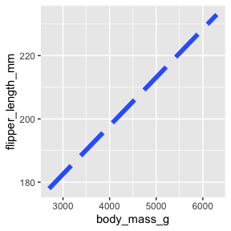<!-- -->

Notes:

1.  you can use “color” or “colour” spelling
2.  you can specify colors using the hex code (e.g. \#000000) or color
    names from [this
    list](http://sape.inf.usi.ch/quick-reference/ggplot2/colour).
3.  you can specify shapes using codes from [this
    list](http://www.sthda.com/english/wiki/ggplot2-point-shapes).

------------------------------------------------------------------------

<a name = "color_shape_group"></a>

#### setting colors/shapes by group

use `aes(color = GROUPING VARIABLE, shape = GROUPING VARIABLE)`
arguments in the `geom_()` parentheses.

This example assigns a different color and shape for each island.

``` r
ggplot(penguins, aes(x = body_mass_g, y = flipper_length_mm)) +
  geom_point(aes(color = island, shape = island), size = 2)
```

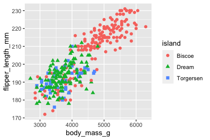<!-- -->

In the example above, `color = ...` and `shape = ...` are in the
`aes()`, so each island gets a shape and color. `size = ...` is outside
the `aes()`, so all the points are of size 2.

This next example assigns a different color and point size for each
island.

``` r
ggplot(penguins, aes(x = body_mass_g, y = flipper_length_mm)) +
  geom_point(aes(color = island, size = island))
```

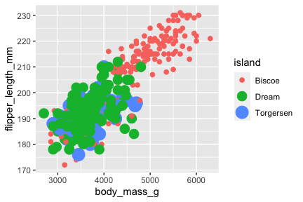<!-- -->

In the examples above, the grouping variables were categorical.  
You can also use numeric variables - you will get a gradient of
color/size

``` r
ggplot(penguins, aes(x = body_mass_g, y = flipper_length_mm)) +
  geom_point(aes(size = body_mass_g))
```

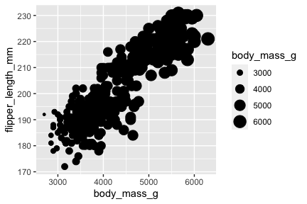<!-- -->

``` r
ggplot(penguins, aes(x = body_mass_g, y = flipper_length_mm)) +
  geom_point(aes(color = body_mass_g))
```

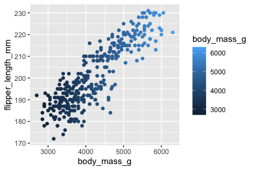<!-- -->

------------------------------------------------------------------------

#### setting colors/shapes for multiple `geoms`

<details>
<summary>
Some examples – click to expand
</summary>

You can use the technique above for each `geom`. Use this to customize
each `geom` separately.

``` r
ggplot(penguins, aes(x = body_mass_g, y = flipper_length_mm)) +
  geom_point(color = "lightblue", size = 3)+
  geom_smooth(method = "lm", se = FALSE, color = "black", size = 2)
```

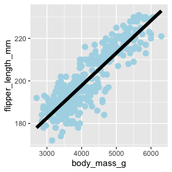<!-- -->

Similarly, you can set color by group for each `geom`.

In this example, we set color by species for the scatterplot only, and
keep the regression line black.

``` r
ggplot(penguins, aes(x = body_mass_g, y = flipper_length_mm)) +
  geom_point(aes(color = species)) +
  geom_smooth(method = "lm", se = FALSE, color = "black", size = 2)
```

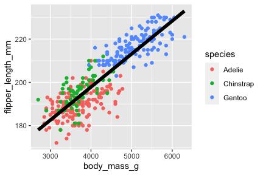<!-- -->

In this example, we set color by species for both, scatterplot and
regression line.

``` r
ggplot(penguins, aes(x = body_mass_g, y = flipper_length_mm)) +
  geom_point(aes(color = species)) +
  geom_smooth(method = "lm", se = FALSE, aes(color = species))
```

We repeated the `aes(color = species)` for both `geoms`.  
A more efficient way is to add this argument to the foundation plot
line.

``` r
ggplot(penguins, aes(x = body_mass_g, y = flipper_length_mm, color = species)) +
  geom_point() +
  geom_smooth(method = "lm", se = FALSE)
```

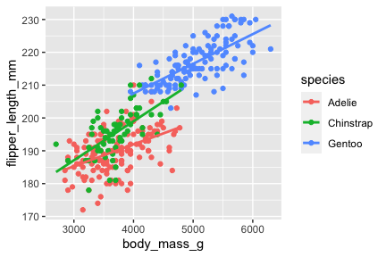<!-- -->

What if you want separate regression lines, but all the same color? Use
`aes(group = ...)`

``` r
ggplot(penguins, aes(x = body_mass_g, y = flipper_length_mm)) +
  geom_point(aes(color = species)) +
  geom_smooth(method = "lm", se = FALSE, aes(group = species), color = "black")
```

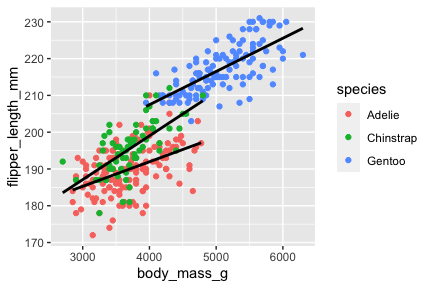<!-- -->

Note: if there are contradicting pieces of code, the most recent
occurrence will override the previous one.

In this example, we want to set color by species
(`aes(color = species`)), but we also have `geom_point(color = "blue")`,
which will override the previous color argument.

``` r
ggplot(penguins, aes(x = body_mass_g, y = flipper_length_mm, aes(color = species))) +
  geom_point(color = "blue") +
  geom_smooth(method = "lm", se = FALSE, aes(group = species), color = "black")
```

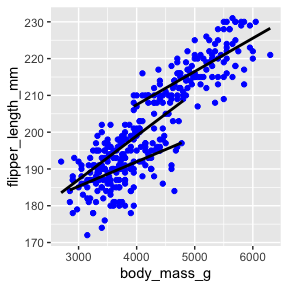<!-- -->

</details>

------------------------------------------------------------------------

<a name = "fill"></a>

#### *color* vs. *fill*

`color` refers to outline color, whereas `fill` refers to object fill
color.

`fill` is typically used for violin plots, boxplots, barplots.

``` r
ggplot(penguins, aes(x = species, y = flipper_length_mm)) +
  geom_violin(color = "black", fill = "yellow")
```

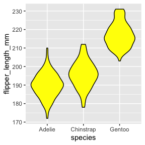<!-- -->

``` r
ggplot(penguins, aes(x = species, y = flipper_length_mm)) +
  geom_violin(color = "black", aes(fill = species))
```

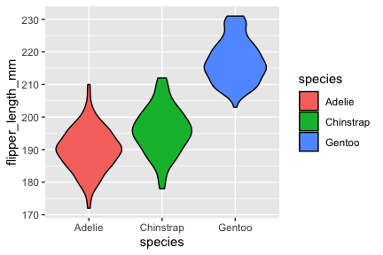<!-- -->

`fill` is can also be applied to `geom_point()` with certain shapes

``` r
ggplot(penguins, aes(x = body_mass_g, y = flipper_length_mm)) +
  geom_point(shape = 21, size = 2, color = "black", aes(fill = species))
```

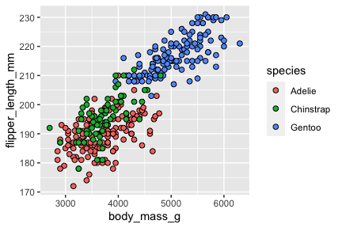<!-- -->

------------------------------------------------------------------------

<a name = "transparency"></a>

#### transparency

Set transparency/opacity for `fill` using `alpha = ...`. `alpha = 0` is
transparent and `alpha = 1` is opaque.

``` r
ggplot(penguins, aes(x = species, y = flipper_length_mm)) +
  geom_violin(color = "black", fill = "yellow", alpha = 0.3)
```

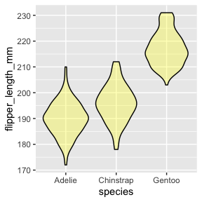<!-- -->

------------------------------------------------------------------------

------------------------------------------------------------------------

<a name = "color_scales"></a>

## Step 4: scales for colors and shapes

[*back to top*](#toc)

**Note: These `scale_` functions work only if you use the
`aes(color = ...)` or `aes(shape = ...)` functions to group by
color/shape.**

------------------------------------------------------------------------

#### manual color scales (for categorical variables)

You can set your own color palettes by using `scale_color_manual()`.  
Specify the colors you want using the [color
names](http://sape.inf.usi.ch/quick-reference/ggplot2/colour) or hex
codes.

``` r
ggplot(penguins, aes(x = body_mass_g, y = flipper_length_mm)) +
  geom_point(aes(color = species))+
  scale_color_manual(values = c("red", "blue", "yellow"))
```

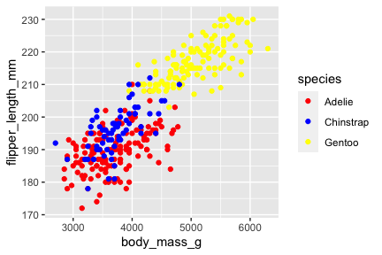<!-- -->

------------------------------------------------------------------------

#### gradient color scales (for numeric/continuous variables)

When setting colors for a continuous variable, use
`scale_color_gradient*()`.

Use `scale_color_gradient()` for a two-color gradient. You can set the
high and low extremes.

``` r
ggplot(penguins, aes(x = body_mass_g, y = flipper_length_mm)) +
  geom_point(aes(color = body_mass_g))+
  scale_color_gradient(low = "red", high = "blue")
```

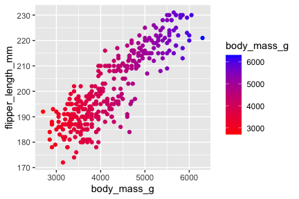<!-- -->

<details>
<summary>
types of gradient scales
</summary>

Use `scale_color_gradient2()` for a diverging color gradient. You can
set the high and low extremes as well as the midpoint and midpoint
color.

``` r
ggplot(penguins, aes(x = body_mass_g, y = flipper_length_mm)) +
  geom_point(aes(color = body_mass_g))+
  scale_color_gradient2(low = "red", high = "blue", mid = "white", midpoint = 4000)
```

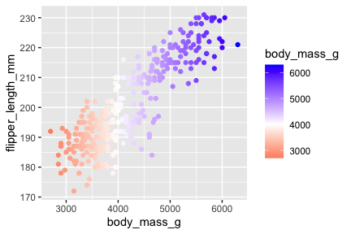<!-- -->

Use `scale_color_gradientn()` if you want to use multiple colors in your
gradient. You can also use a pre-defined color palette,
e.g. `{soilpalettes}`.

``` r
ggplot(penguins, aes(x = body_mass_g, y = flipper_length_mm)) +
  geom_point(aes(color = body_mass_g))+
  scale_color_gradientn(colors = c("blue", "green", "yellow", "orange", "red"))
```

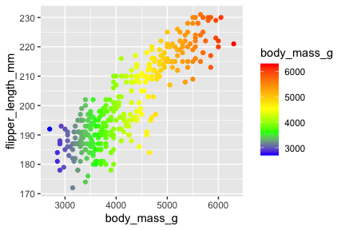<!-- -->

</details>
<details>
<summary>
example color palettes
</summary>

You can use the [`brewer` color
palettes](https://www.datanovia.com/en/blog/the-a-z-of-rcolorbrewer-palette/)

``` r
ggplot(penguins, aes(x = body_mass_g, y = flipper_length_mm)) +
  geom_point(aes(color = species))+
  scale_color_brewer(palette = "Dark2")
```

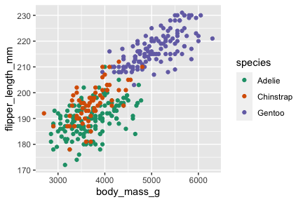<!-- -->

You can also use other pre-defined palettes created by other users.
Included here are
[`{PNWPalettes}`](https://github.com/jakelawlor/PNWColors) and
[`{soilpalettes}`](https://github.com/kaizadp/soilpalettes).

``` r
ggplot(penguins, aes(x = body_mass_g, y = flipper_length_mm)) +
  geom_point(aes(color = species))+
  scale_color_manual(values = PNWColors::pnw_palette("Sunset2",3))
```

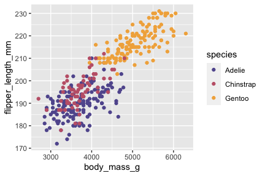<!-- -->

``` r
ggplot(penguins, aes(x = body_mass_g, y = flipper_length_mm)) +
  geom_point(aes(color = species))+
  scale_color_manual(values = soilpalettes::soil_palette("podzol",3))
```

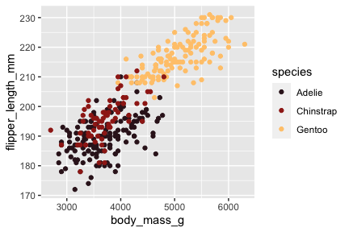<!-- -->

``` r
ggplot(penguins, aes(x = body_mass_g, y = flipper_length_mm)) +
  geom_point(aes(color = body_mass_g))+
  scale_color_gradientn(colors = soilpalettes::soil_palette("podzol", 5))
```

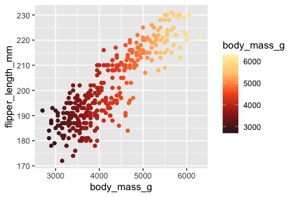<!-- -->

</details>

------------------------------------------------------------------------

#### scales for shapes

Similar to colors, you can set the shapes using `scale_shape_manual()`,
using the codes
[here](http://www.sthda.com/english/wiki/ggplot2-point-shapes).

``` r
ggplot(penguins, aes(x = body_mass_g, y = flipper_length_mm)) +
  geom_point(aes(shape = species))+
  scale_shape_manual(values = c(1, 16, 4))
```

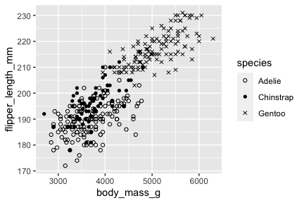<!-- -->

------------------------------------------------------------------------

------------------------------------------------------------------------

<a name = "axes"></a>

## Step 5: formatting axes

[*back to top*](#toc)

------------------------------------------------------------------------

<a name = "axis_limits"></a>

#### setting axis limits

Option 1: `xlim()` and `ylim()`  
Option 2: `scale_x_continuous()` and `scale_y_continuous()`

Option 2 may look more complicated, but it is useful when you want to
customize the axes even more (e.g. breaks and ticks)

``` r
ggplot(penguins, aes(x = body_mass_g, y = flipper_length_mm)) +
  geom_point()+
  xlim(3000, 5000)+
  ylim(130, 250)
```

``` r
ggplot(penguins, aes(x = body_mass_g, y = flipper_length_mm)) +
  geom_point()+
  scale_x_continuous(limits = c(3000, 5000))+
  scale_y_continuous(limits = c(130, 250))
```

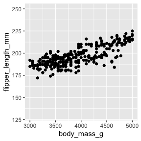<!-- -->

------------------------------------------------------------------------

<a name = "axis_labels"></a>

#### setting axis labels

Option 1: `xlab()` and `ylab()`  
Option 2: `labs(x = ..., y = ...)`

``` r
ggplot(penguins, aes(x = body_mass_g, y = flipper_length_mm)) +
  geom_point()+
  xlab("body mass (g)")+
  ylab("flipper length (mm)")
```

``` r
ggplot(penguins, aes(x = body_mass_g, y = flipper_length_mm)) +
  geom_point()+
  labs(x = "body mass (g)", y = "flipper length (mm)")
```

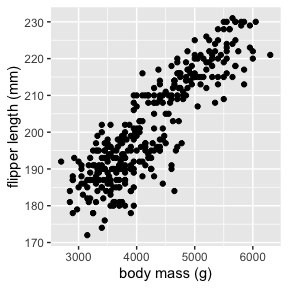<!-- -->

<details>
<summary>
for tips on more complicated axis labels, click here
</summary>

coming soon. good luck.

</details>

------------------------------------------------------------------------

<a name = "axis_scales"></a>

#### axis scales

You can use `scale_x_*()` and `scale_y_*` to set axis label, limits,
major and minor breaks, and axis position

When working with a numerical/continuous axis, use
`scale_x_continuous()`

``` r
ggplot(penguins, aes(x = body_mass_g, y = flipper_length_mm)) +
  geom_point()+
  scale_x_continuous(limits = c(4000, 6000), 
                     breaks = seq(4000, 5000, by = 500), 
                     minor_breaks = seq(5000, 6000, by = 100))
```

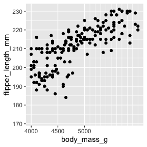<!-- -->

When working with a categorical axis, use `scale_x_discrete()`

In this example, we set the x axis label and rename the tick labels
(species).

``` r
ggplot(penguins, aes(x = species, y = flipper_length_mm)) + 
  geom_point()+
  scale_x_discrete("Penguin Species", 
                   labels = c("Adelie" = "A", "Chinstrap" = "C", "Gentoo" = "G"))
```

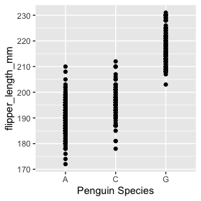<!-- -->

``` r
ggplot(penguins, aes(x = species, y = flipper_length_mm)) +
  geom_point()+
  scale_x_discrete(position = "top")
```

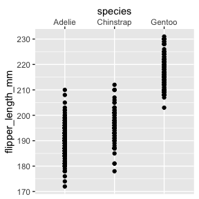<!-- -->

<details>
<summary>
axis transformations
</summary>

coming soon

</details>

------------------------------------------------------------------------

You can also modify the following aspects of axes, but those must be
done through `theme()`:

-   font size
-   font family
-   bold, italics, etc.
-   axis margin/spacing

------------------------------------------------------------------------

------------------------------------------------------------------------
