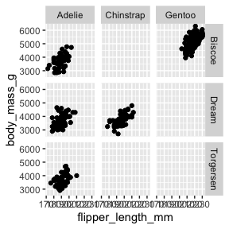

ggplot2 – working with facets/panels
================

``` r
library(palmerpenguins)
library(ggplot2)
```

## Step 7: facets and panels

``` r
ggplot(penguins, aes(x = flipper_length_mm, y = body_mass_g))+
  geom_point()+
  facet_wrap(~species)
```

<!-- -->

``` r
ggplot(penguins, aes(x = flipper_length_mm, y = body_mass_g))+
  geom_point()+
  facet_wrap(~species, scales = "free_x")
```

<!-- -->

``` r
ggplot(penguins, aes(x = flipper_length_mm, y = body_mass_g))+
  geom_point()+
  facet_grid(island~species)
```

<!-- -->

``` r
ggplot(penguins, aes(x = flipper_length_mm, y = body_mass_g))+
  geom_point()+
  facet_grid(.~species)
```

<!-- -->

``` r
ggplot(penguins, aes(x = flipper_length_mm, y = body_mass_g))+
  geom_point()+
  facet_grid(island~.)
```

<!-- -->
