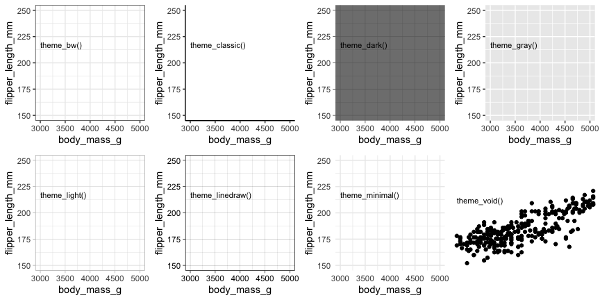
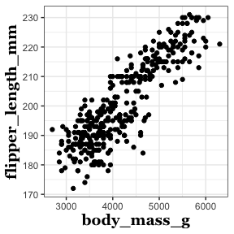
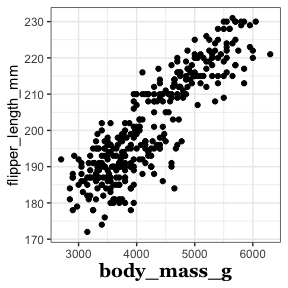
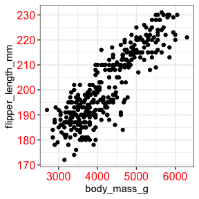
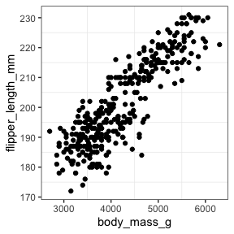
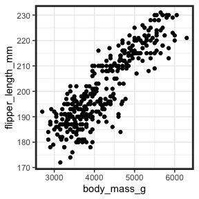
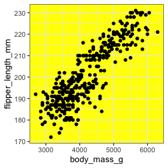
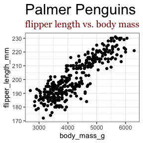

ggplot2 – working with themes
================

``` r
library(palmerpenguins)
library(ggplot2)
```

## Step 6: themes

[*back to top*](#toc)

You can use pre-defined themes to change the look of your plots.

The default is `theme_gray()`. Here are the available options.

<!-- -->

You can use `theme()` to customize other features of the plot, such as
font size, font color, plot color, legend position, etc. \[coming soon\]

`element_blank()`

`element_text()`

`element_rect()`

------------------------------------------------------------------------

<a name = "axis_text"></a>

#### axis titles and text

``` r
p = ggplot(penguins, aes(x = body_mass_g, y = flipper_length_mm)) + 
  geom_point() + 
  theme_bw()
```

``` r
p + theme(axis.title = element_text(face = "bold", 
                                    size = 14, 
                                    family = "Georgia"))
```

<!-- -->

``` r
p + theme(axis.title.x = element_text(face = "bold", 
                                    size = 14, 
                                    family = "Georgia"))
```

<!-- -->

``` r
p + theme(axis.text = element_text(size = 12, color = "red"))
```

<!-- -->

------------------------------------------------------------------------

<a name = "gridlines"></a>

##### removing gridlines

``` r
p + theme(panel.grid = element_blank())
```

<!-- -->

``` r
p + theme(panel.grid.major = element_blank())
```

<!-- -->

------------------------------------------------------------------------

<a name = "border"></a>

##### setting panel border

``` r
p + theme(panel.border = element_rect(size = 2))
```

<!-- -->

##### setting panel background

``` r
p + theme(panel.background = element_rect(fill = "yellow"))
```

<!-- -->

------------------------------------------------------------------------

<a name = "format_title"></a>

##### adjusting title, subtitle

``` r
p + labs(title = "Palmer Penguins", subtitle = "flipper length vs. body mass") +
  theme(plot.title = element_text(size = 22),
        plot.subtitle = element_text(size = 14, color = "darkred", family = "Georgia"))
```

<!-- -->

------------------------------------------------------------------------

------------------------------------------------------------------------
