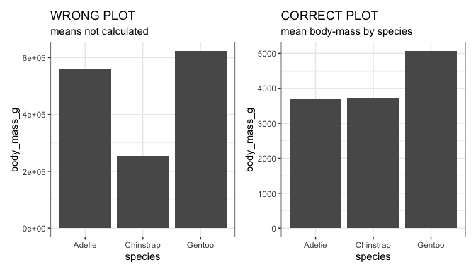

Bar Graphs
================

``` r
library(tidyverse)
library(palmerpenguins)

theme_set(theme_bw())
```

A bar plot provides a summary (mean) for a given variable. To do so, you
have to provide the mean to be plotted. This can be done ahead of the
plot, or it can be done in the plot. (I prefer to do it ahead of the
plot.) Skipping this step will create a totally f\*\*\*\*d up graph.

Example: What is the average body mass by penguin species?

``` r
gg_bar1 = penguins %>% 
  ggplot(aes(x = species, y = body_mass_g))+
  geom_bar(stat = "identity")+
  labs(title = "WRONG PLOT",
       subtitle = "means not calculated")

gg_bar2 = penguins %>% 
  group_by(species) %>% 
  dplyr::summarise(body_mass_g = mean(body_mass_g, na.rm = TRUE)) %>% 
  ggplot(aes(x = species, y = body_mass_g))+
  geom_bar(stat = "identity")+
  labs(title = "CORRECT PLOT",
       subtitle = "mean body-mass by species")
```

<!-- -->

**NOTE**: Bar plots are often not ideal, because they provide only the
summary, and not the distribution or the actual data points themselves.
If you do decide to use a bar graph for something like this, it is a
good idea to also overlay the original data points.

``` r
penguins %>% 
  group_by(species) %>% 
  dplyr::summarise(body_mass_g = mean(body_mass_g, na.rm = TRUE)) %>% 
  ggplot(aes(x = species, y = body_mass_g))+
  geom_bar(stat = "identity", fill = "grey80")+
  geom_jitter(data = penguins, width = 0.2)
```

<!-- -->

------------------------------------------------------------------------

### Special examples

**Example: What species are present on what island?**

Here, we wish to determine the percentage of each species per island.
First, calculate the summary.

``` r
penguins_summary = 
  penguins %>% 
  group_by(species, island) %>% 
  dplyr::summarise(n = n()) %>% 
  group_by(island) %>% 
  dplyr::mutate(total = sum(n),
                percent = (n/total)*100)
```

Now, we have two options for bar graphs.

**Dodged/grouped bar plots**

Here, we use `position_dodge()` to separate the bars. Play around with
the spacing and the bar width.

``` r
gg_dodged = penguins_summary %>% 
  ggplot(aes(x = island, y = percent, fill = species))+
  geom_bar(stat = "identity", position = position_dodge(width = 0.6), width = 0.4)+
  theme_bw()+
  theme(legend.position = "top")
```

**Stacked bar plots**

``` r
gg_stacked = penguins_summary %>% 
  ggplot(aes(x = island, y = percent, fill = species))+
  geom_bar(stat = "identity", position = "stack")+
  theme_bw()+
  theme(legend.position = "top")
```

<!-- -->
