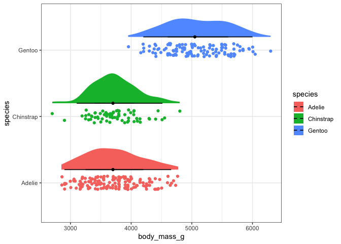

Raincloud Plots
================

Raincloud plots are a beautiful way to show distribution of the data.

This example uses the [`{ggdist}`
package](https://mjskay.github.io/ggdist/index.html).

[RainCloudPlots](https://github.com/RainCloudPlots/RainCloudPlots) is
another option.

``` r
library(ggdist)
```

``` r
library(tidyverse)
library(palmerpenguins)

theme_set(theme_bw())
```

You create the raincloud plot with `stat_halfeye()` and `geom_jitter()`.
Because both the geoms will be plotted at the same position, you need to
*nudge* the halfeye a little.

Also, the `stat_halfeye()` may not work if you have NAs in your column,
so clean that first.

``` r
set.seed(100)
penguins %>% 
    drop_na() %>% 
    ggplot(aes(y = species, x = body_mass_g))+
    ggdist::stat_halfeye(aes(fill = species), 
                         size = 1, 
                         position = position_nudge(y = 0.2), height = 0.5)+
    geom_jitter(aes(color = species), height = 0.1, )
```

<!-- -->

In both geoms, the `height =` argument constrains the height of the
spread.
