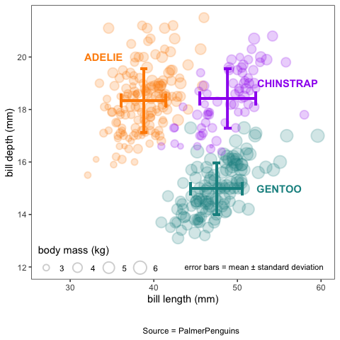
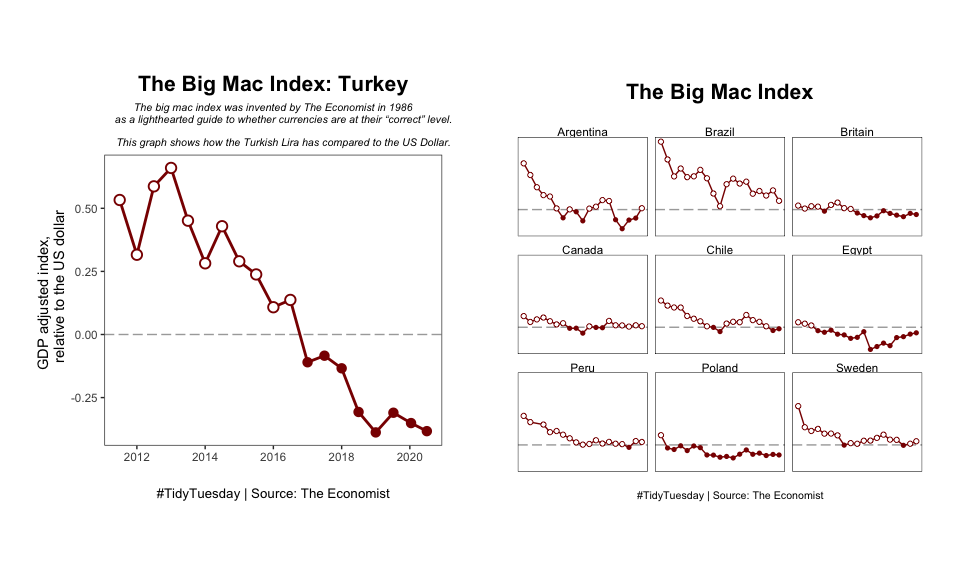

ggplot practice
================

Practice plots for data visualization/`{tidyverse}` skills.

You may need to process the data files before you can create the plots.
Hints and code are provided for each plot.

-----

## Palmer Penguins

Source:
[`{palmerpenguins}`](https://github.com/allisonhorst/palmerpenguins).
This dataset can be accessed by loading the `{palmerpenguins}` package,
see below. This will load the file `penguins`.

``` r
library(palmerpenguins)
```

This graph was inspired by [Cédric
Scherer](https://github.com/Z3tt/TidyTuesday/tree/master/plots/2020_31)

<!-- -->

<details>

<summary>Need a hint? Click here</summary>

  - This graph uses two datasets: (a) the `penguins` dataset to create
    the scatterplot, and (b) a summary dataset for the error bars, which
    must be created from the `penguins` dataset.
  - Use `{dplyr}` tools (`group_by()`, `summarize()`) to calculate means
    and standard deviations.
  - Color palette used is: `pal <- c("#FF8C00", "#A034F0", "#159090")`.

</details>

<details>

<summary>Need the code? Click here</summary>

``` r
# load packages
library(palmerpenguins)
library(tidyverse)

# set the color palette
pal <- c("#FF8C00", "#A034F0", "#159090")


# plot 1 (base scatterplot) ----
gg_penguins1 =
  penguins %>% 
  ggplot(aes(x = bill_length_mm, y = bill_depth_mm, color = species, fill = species))+
  
  geom_point(aes(size = (body_mass_g/1000)), alpha = 0.2, shape = 21, stroke = 1)+
  
  # we are using shape = 21 (filled circle), which has both color and fill arguments
  scale_color_manual(values = pal)+
  scale_fill_manual(values = pal)+
  
  # set axis labels, title, caption, etc. 
  labs(x = "bill length (mm)",
       y = "bill depth (mm)",
       size = "body mass (kg)",
       #title = "Exploring the PalmerPenguins Dataset",
       caption = "
       
       Source = PalmerPenguins") +
  
  # add text via annotations to label the three species
  # this is an alternative to putting the colors in the legend
  annotate("text", label = "ADELIE", x = 34, y = 20, color = "#FF8C00", fontface = "bold")+
  annotate("text", label = "CHINSTRAP", x = 56, y = 19, color = "#A034F0", fontface = "bold")+
  annotate("text", label = "GENTOO", x = 55, y = 15, color = "#159090", fontface = "bold")+
  
  guides(color=FALSE, fill = FALSE, size=guide_legend(title.position = "top"))+
  
  # set axis limits
  # x axis is easier, but y-axis needs the scale_* function to set breaks
  xlim(27,60)+
  scale_y_continuous(breaks = seq(12,20, by = 2))+
  
  # set and customize the theme
  theme_bw()+
  theme(panel.grid = element_blank(),
        legend.position = c(0.22, 0.07),
        legend.direction = "horizontal",
        legend.background = element_rect(fill = NA),
        plot.title = element_text(hjust = 0.5, face = "bold"),
        plot.caption = element_text(hjust = 0.5)
  )


# plot 2 (error bars) ----

# create a summary dataframe that has mean/sd values
penguins_summary = 
  penguins %>% 
  group_by(species) %>% 
  dplyr::summarise(length_mean = mean(bill_length_mm, na.rm = TRUE),
                   length_sd = sd(bill_length_mm, na.rm = TRUE),
                   depth_mean = mean(bill_depth_mm, na.rm = TRUE),
                   depth_sd = sd(bill_depth_mm, na.rm = TRUE),
                   #length_se = sd(bill_length_mm, na.rm = TRUE)/sqrt(n()),
                   #depth_se = sd(bill_depth_mm, na.rm = TRUE)/sqrt(n())
                   ) %>% 
  left_join(penguins, by = "species")


# now use this summary dataframe to add error bars onto the first plot
gg_penguins1 + 
  geom_errorbar(data = penguins_summary, 
                aes(xmin = length_mean-length_sd, 
                    xmax = length_mean+length_sd, 
                    y = depth_mean,
                    color = species),
                width = 0.5, size = 1) +
  geom_errorbar(data = penguins_summary, 
                aes(ymin = depth_mean-depth_sd, 
                    ymax = depth_mean+depth_sd, 
                    x = length_mean,
                    color = species),
                width = 0.8, size = 1) +
  annotate("text", label = "error bars = mean ± standard error", x = 52, y = 12, size = 3)
```

</details>

-----

## The Big Mac Index

Source:
[TidyTuesday](https://github.com/rfordatascience/tidytuesday/tree/master/data/2020/2020-12-22)

Use this code to download the data

``` r
big_mac <- readr::read_csv('https://raw.githubusercontent.com/rfordatascience/tidytuesday/master/data/2020/2020-12-22/big-mac.csv')
```

<!-- -->

<details>

<summary>Need a hint? Click here</summary>

  - We are setting different shapes for + and - values. To do this,
    create a new binary variable for above/below, and use that in
    `aes(shape = ...)`.
  - Horizontal line at y = 0: `geom_hline (yintercept = 0)`
  - Gridlines can be removed using `theme()`

For the second plot,

  - Choose a few countries using `filter(name %in% c(...))`
  - Panels created using `facet_wrap()`

</details>

<details>

<summary>Need the code? Click here</summary>

``` r
library(tidyverse)

# data processing 

## process the data file, using usd_adjusted as reference
## create a new variable for over/under

big_mac_processed = 
  big_mac %>% 
  filter(!is.na(usd_adjusted)) %>% 
  mutate(valued = if_else(usd_adjusted > 0, "over", "under")) 


# data visualization -- 1

gg_bigmac_turkey =
  big_mac_processed %>% 
  filter(name == "Turkey") %>% 
  
  ggplot(aes(x = date, y = usd_adjusted)) +
  
  # set the horizontal line first, as that will go under all the other geoms
  geom_hline(yintercept = 0, linetype = "longdash", alpha = 0.4)+

  geom_path(color = "darkred", size = 1)+
  geom_point(aes(shape = valued), color = "darkred", size = 3, stroke = 1, fill = "white") + 
  scale_shape_manual(values = c(21, 16))+
  
  labs(title = "The Big Mac Index: Turkey",
       subtitle = "The big mac index was invented by The Economist in 1986
       as a lighthearted guide to whether currencies are at their “correct” level.
       
       This graph shows how the Turkish Lira has compared to the US Dollar.",
       caption = "#TidyTuesday | Source: The Economist",
       x = "",
       y = "GDP adjusted index, 
       relative to the US dollar") + 
  
  theme_bw() +
  theme(
    legend.position = "none",
    panel.grid = element_blank(),
    plot.title = element_text(face = "bold", size = 16, hjust = 0.5),
    plot.subtitle = element_text(face = "italic", size = 8, hjust = 0.5),
    plot.caption = element_text(size = 10, hjust = 0.5),
    plot.margin = margin(t = 2, r = 1, b = 2, l = 1, unit = "cm")
  ) 


# data visualization -- 2

gg_bigmac_all = 
  big_mac_processed %>% 
  # select a few countries. this is a random list to get a 3x3 set of panels
  filter(name %in% c("Argentina", "Brazil", "Britain", 
                     "Canada", "Chile", "Egypt",
                     "Peru", "Poland", "Sweden")) %>% 
  
  ggplot(aes(x = date, y = usd_adjusted)) +
  geom_hline(yintercept = 0, linetype = "longdash", alpha = 0.4)+
  geom_path(color = "darkred")+
  geom_point(aes(shape = valued), color = "darkred", size = 1.5, fill = "white") + 
  scale_shape_manual(values = c(21, 16))+
  
  labs(title = "The Big Mac Index
       ",
       caption = "
       #TidyTuesday | Source: The Economist",
       x = "",
       y = "GDP adjusted index, 
       relative to the US dollar") + 
  facet_wrap(~name)+
  
  theme_void() +
  theme(
    legend.position = "none",
    panel.grid = element_blank(),
    panel.border = element_rect(fill = NA),
    plot.title = element_text(face = "bold", size = 16, hjust = 0.5),
    plot.subtitle = element_text(face = "italic", size = 8, hjust = 0.5),
    plot.caption = element_text(size = 8, hjust = 0.5),
    plot.margin = margin(t = 2, r = 1, b = 2, l = 1, unit = "cm")
  ) 
```

</details>

-----

<details>

<summary>Session Info</summary>

**Kaizad F. Patel**

Date last run: 2021-01-02

    ## R version 4.0.2 (2020-06-22)
    ## Platform: x86_64-apple-darwin17.0 (64-bit)
    ## Running under: macOS Catalina 10.15.7
    ## 
    ## Matrix products: default
    ## BLAS:   /Library/Frameworks/R.framework/Versions/4.0/Resources/lib/libRblas.dylib
    ## LAPACK: /Library/Frameworks/R.framework/Versions/4.0/Resources/lib/libRlapack.dylib
    ## 
    ## locale:
    ## [1] en_US.UTF-8/en_US.UTF-8/en_US.UTF-8/C/en_US.UTF-8/en_US.UTF-8
    ## 
    ## attached base packages:
    ## [1] stats     graphics  grDevices utils     datasets  methods   base     
    ## 
    ## other attached packages:
    ##  [1] forcats_0.5.0        stringr_1.4.0        dplyr_1.0.1         
    ##  [4] purrr_0.3.4          readr_1.3.1          tidyr_1.1.1         
    ##  [7] tibble_3.0.3         ggplot2_3.3.2        tidyverse_1.3.0     
    ## [10] palmerpenguins_0.1.0
    ## 
    ## loaded via a namespace (and not attached):
    ##  [1] Rcpp_1.0.5       cellranger_1.1.0 pillar_1.4.6     compiler_4.0.2  
    ##  [5] dbplyr_1.4.4     tools_4.0.2      digest_0.6.25    lubridate_1.7.9 
    ##  [9] jsonlite_1.7.0   evaluate_0.14    lifecycle_0.2.0  gtable_0.3.0    
    ## [13] pkgconfig_2.0.3  rlang_0.4.7      reprex_0.3.0     cli_2.0.2       
    ## [17] DBI_1.1.0        rstudioapi_0.11  yaml_2.2.1       haven_2.3.1     
    ## [21] xfun_0.16        withr_2.2.0      xml2_1.3.2       httr_1.4.2      
    ## [25] knitr_1.29       fs_1.5.0         hms_0.5.3        generics_0.0.2  
    ## [29] vctrs_0.3.2      grid_4.0.2       tidyselect_1.1.0 glue_1.4.1      
    ## [33] R6_2.4.1         fansi_0.4.1      readxl_1.3.1     rmarkdown_2.3   
    ## [37] modelr_0.1.8     blob_1.2.1       magrittr_1.5     backports_1.1.8 
    ## [41] scales_1.1.1     ellipsis_0.3.1   htmltools_0.5.0  rvest_0.3.6     
    ## [45] assertthat_0.2.1 colorspace_1.4-1 stringi_1.4.6    munsell_0.5.0   
    ## [49] broom_0.7.0      crayon_1.3.4

</details>
