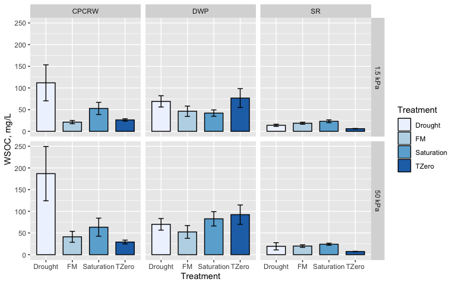
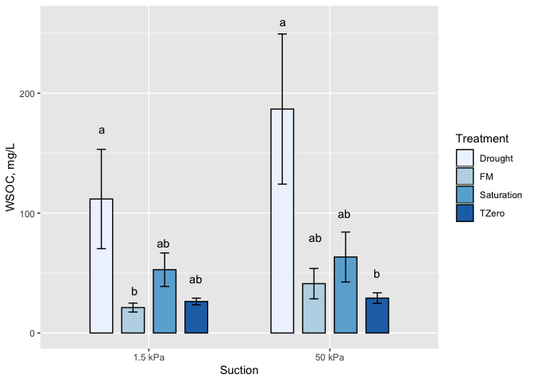

ggplot\_example
================
Kaizad Patel
4/6/2020

Try to recreate these graphs using the `wsoc_processed.csv` file.  
The code is in `3b-ggplot_example.Rmd` if needed.

**Figure 1. WSOC in the three different sites, for four different
treatments, in two different suctions**  
brewer color palette (default) used
<!-- -->

**Figure 2. How do the moisture treatments affect CPCRW porewaters?**

<!-- -->
