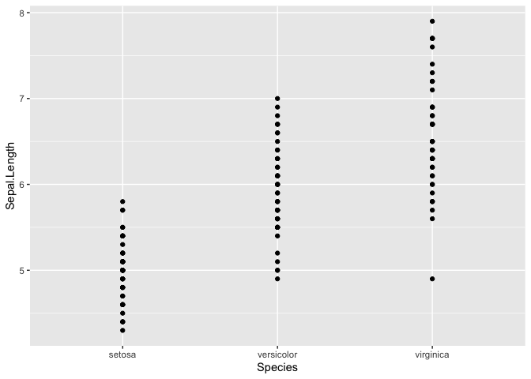

Untitled
================
Kaizad F. Patel
12/18/2020

## R Markdown

This is an R Markdown document. Markdown is a simple formatting syntax
for authoring HTML, PDF, and MS Word documents. For more details on
using R Markdown see <http://rmarkdown.rstudio.com>.

When you click the **Knit** button a document will be generated that
includes both content as well as the output of any embedded R code
chunks within the document. You can embed an R code chunk like this:

``` r
summary(cars)
```

    ##      speed           dist       
    ##  Min.   : 4.0   Min.   :  2.00  
    ##  1st Qu.:12.0   1st Qu.: 26.00  
    ##  Median :15.0   Median : 36.00  
    ##  Mean   :15.4   Mean   : 42.98  
    ##  3rd Qu.:19.0   3rd Qu.: 56.00  
    ##  Max.   :25.0   Max.   :120.00

## Including Plots

You can also embed plots, for example:

``` r
plot(pressure)
```

<!-- -->

``` r
names(iris)
```

    ## [1] "Sepal.Length" "Sepal.Width"  "Petal.Length" "Petal.Width"  "Species"

``` r
iris %>% 
  ggplot(aes(x = Species, y = `Sepal.Length`))+
  geom_point()
```

<!-- -->

Note that the `echo = FALSE` parameter was added to the code chunk to
prevent printing of the R code that generated the plot.

# Header1

## Header2

### Header3

#### 4

##### 5

###### 6

###### \# 7

**bold** **two**

*italic* *one* asterisk

-----

-----

aaa

-----

adding two numbers

``` r
a = 1203
b = 2132
```

in-line r

The sum of the two numbers is: 3335.
