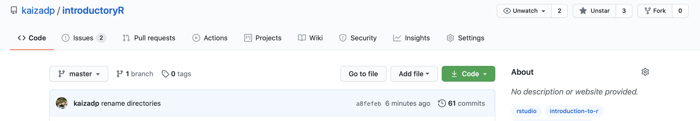

introductoryR
================
Kaizad F. Patel, *soil nerd and R enthusiast*

-----

**Jan 27, 2021 update: Check out the repository [Wiki](https://github.com/kaizadp/introductoryR/wiki) to see the tutorials.**

-----

This repository includes scripts, tutorials,  and practice datasets for R beginners. 

Download R [here](https://www.r-project.org) and RStudio
[here](https://rstudio.com).  
Download *both* programs, we will use RStudio as a User Interface (UI)
to run R.

-----

## Using this repository  

#### to download the entire repository with GitHub Desktop (recommended):
You will need (a) a GitHub account and (b) [GitHub Desktop](https://desktop.github.com). 

1. Click on the green `Code` button.  
1. Select `Open with GitHub Desktop`.   
1. Set the location on your local computer, which will mirror the online repository.
1. To access the most recent edits to the repository, open GitHub Desktop, click on `Fetch Origin` and then `Pull Origin`. Alternatively, select `Git`>`Pull` in the Rproject in RStudio.

#### to download the entire repository without GitHub:
Download all the R scripts and files and use as you wish.

1\. Click on `Clone or download`  
2\. Select `Download ZIP`

#### to download an individual file:
1\. Click on the file  
2\. Right-click on `Raw`  
3\. Select the `Save/Download Linked File As ...` option to save the file

  - save all the files in one location and maintain the directory
    structure (e.g. `data` and `processed` directories)  
  - create a new empty directory `processed`, you will export processed
    files there.

-----

## Navigating this repository  

**Wiki**: You will find the tutorials here.

**Issues**: You can find useful links and resources here. You can also use this section to leave suggestions for tutorials/scripts you would like to see in the near future. 

-----

Last updated: 2021-03-19
